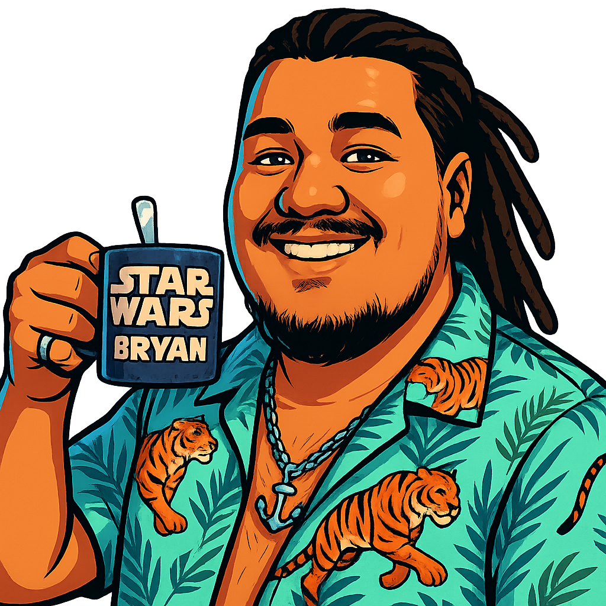

<table width="100%">
  <tr>
    <td width="150">
      
    </td>
    <td>
      <h2>👋 ¡Hola! / Hello! I'm Bryan Cambar</h2>
      

        🎮 Game Developer &nbsp;|&nbsp; 💻 Fullstack Developer &nbsp;|&nbsp; ☁️ Cloud & Automation  
         
        🧠 DB Architecture &nbsp;|&nbsp; 🌍 Bilingual &nbsp;|&nbsp; 🔐 Curious about Networking & Security  
         
        🚀 Creator of <strong>Vicio</strong> &nbsp;|&nbsp; 🎙️ Host of <strong>Coffee & Dev</strong>
      

    </td>
  </tr>
</table>

---

## 🌍 Welcome · Bienvenido

  
🇺🇸 English

Hi! I'm **Bryan**, a Systems Engineer with a strong background in software and game development.  
Over the years, I've built experience in:

- 🎮 **Game Development**: Unreal Engine, C++, asset integration
- 🧱 **Web Development**: Node.js, FastAPI, Django, SQL, TailwindCSS, Next.js, Astro, Docker
- 🧠 **Database Design**: I’m passionate about relational database modeling and performance tuning (SQL Server, PostgreSQL, MySQL)
- ☁️ **Automation & Cloud**: AWS, Azure, Terraform, Jenkins, CI/CD pipelines
- 🔐 **Networking & Security**: Basic knowledge with growing interest in becoming an expert

I love solving real-world problems with scalable architecture and clean, maintainable code.  
Whether it’s building backend APIs, integrating with external services, or designing game logic, I bring both creativity and structure.

---

### 🎮 🚀 Creator of [**Vicio**](#) (in development)  

**Vicio** is an ambitious project in development, built with multiple technologies, aiming to deliver an immersive experience on both mobile and web platforms. It’s designed to become a (non-playable) video game library and a social network for gamers.

In **Vicio**, you’ll be able to:

- 📚 Keep track of your video games and explore them by genre, platform, or popularity.  
- 💬 Share opinions, write reviews, and rate video games.  
- 🎓 Create and discover tutorials focused on achievement hunting.  
- 🌟 Rate tutorials, comment on them, and reply to others' comments.  
- 🧑‍🤝‍🧑 Build your friends network: add or remove users, discover new profiles, and follow their activity.

> A gamer community where collaboration, progress, and experience come together.

🛠️ Technologies

        

---

### 🎙️ Host & Creator of [**Coffee & Dev**](http://www.youtube.com/@CoffeeDev-j7i)

A podcast where we talk about the real, day-to-day life of software developers — from burnout and motivation, to career paths and technology trends.
--- ---
📬 **Let’s connect** — If you’re building something impactful and need someone who delivers, I’m ready.

  
🇪🇸 Español

¡Hola! Soy **Bryan**, Ingeniero en Sistemas con sólida experiencia en desarrollo de software y videojuegos.  
A lo largo de los años, he trabajado en:

- 🎮 **Desarrollo de Videojuegos**: Unreal Engine, C++, integración de assets
- 🧱 **Desarrollo Web**: Node.js, FastAPI, Django, SQL, TailwindCSS, Next.js, Astro, Docker
- ☁️ **Automatización y Cloud**: AWS, Azure, Terraform, Jenkins, pipelines CI/CD
- 🔐 **Redes y Seguridad**: Conocimientos básicos, pero gran interés por especializarme más
- 🧠 **Diseño de Bases de Datos**: Me apasiona el modelado relacional y la optimización de consultas (SQL Server, PostgreSQL, MySQL)

Me encanta resolver problemas reales con arquitectura escalable y código limpio.  
Ya sea construyendo APIs, conectando servicios externos o programando la lógica de un videojuego, aporto creatividad y estructura.

---

### 🎮 🚀 Creador de [**Vicio**](#) (en desarrollo)  

**Vicio** es un proyecto ambicioso en desarrollo, construido con múltiples tecnologías, que busca crear una experiencia inmersiva tanto en móvil como en la web. Su objetivo es convertirse en una biblioteca (no jugable) de videojuegos y una red social para gamers.

En **Vicio** podrás:

- 📚 Llevar un registro de tus videojuegos y explorarlos por género, plataforma o popularidad.  
- 💬 Compartir opiniones, escribir reseñas y puntuar videojuegos.  
- 🎓 Crear y encontrar tutoriales enfocados en la obtención de logros.  
- 🌟 Puntuar tutoriales, comentar sobre ellos y responder a los comentarios.  
- 🧑‍🤝‍🧑 Construir tu red de amigos: agrega o elimina usuarios, descubre nuevos perfiles y sigue sus actividades.

> Una comunidad gamer donde la colaboración, el progreso y la experiencia se mezclan.

🛠️ Tecnologías utilizadas

        

---

### 🎙️ Creador y parte de [**Coffee & Dev**](#) 

Un podcast donde hablamos sobre el día a día real de los desarrolladores de software — desde el burnout y la motivación, hasta trayectorias profesionales y tendencias tecnológicas.
--- ---
📬 **Contáctame** — Si estás desarrollando algo importante y necesitas a alguien que cumpla, estoy listo.

---

## 📈 GitHub Stats

  
  

---

## 📫 Contact Me

- 🌐 Portfolio: [bryancambar](https://bryancambar.netlify.app/)
- 💼 LinkedIn: [bryan-cámbar](https://www.linkedin.com/in/bryan-c%C3%A1mbar/)

---

Made with ❤️ by Bryan Cambar
